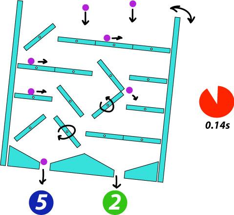

# flipmaster

A vanilla javascript (no libraries) game where you play against the computer to collect the most balls

## The Game

Flipmaster is a fresh take on the classic game in which balls fall under the influence of gravity and are directed left or right by a series of levers.

In this take on the game, the player and computer alternate flipping levers to get more balls falling into their bin. The play will have a limited time in which to make a move, and if they don't move within that time, they lose their turn. Additionally, the whole mechanism will be rotating back and forth, making it harder to predict ball movement.

## Functionality & MVP

### Users will be able to:

- Start and reset the game
- Rotate levers by clicking on their tips

### The game will:

- Consist of a single screen
- Have balls fall from random places along the top of the screen
- Have balls move with gravity and along constraints
- Display a series of levers, each of which can be set
- Have a rotating frame holding all the levers
- Show each player's score
- Have sound effects where appropriate
- Show a timer when its the player's turn

### Bonus features

- Multiple levels with shorter timers and more balls

### Sample Layout

### Architecture

- The game will be rendered on a canvas element
- The game logic physics engine will be written in javascript
- Modules will be transpiled with webpack

## Project Schedule

### Day 1

- Establish development environment
- Establish runtime cycle (calculation - render)
- Write shell for all game classes

### Day 2

- Layout
- Physics engine

### Day 3

- Lever movement
- Hard body interaction

### Day 4

- Scoring
- Visual appeal

### Day 5

- Sound effects
